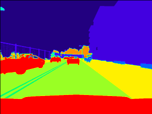
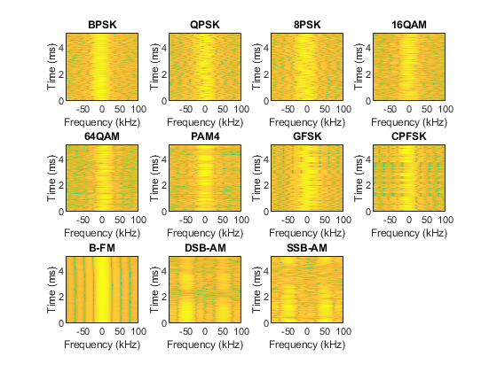

<!-- Style for Publications Page -->

<table>
	<tbody>
    	<tr>
			<td>
	  			
			</td>
      		<td class="paper_text">
				<strong>
					<a href="https://github.com/dks2000dks/Autonomous-Driving">Reinforcement Learning for Autonomous Navigation</a>
				</strong>
				 
				Guide: <a href="https://people.iith.ac.in/sumohana/" style="color:black;">Dr. Sumohana S. Channappayya</a>
				

				<ul>
					<li>
						Using reinforcement learning for autonomous navigation of cars with two objectives. One making sure the car is in the lane and the speed of the car is under speed limit.
					</li>
					<li>
						Agent can regulate speed and steering angle of car and is trained using Deep Q Learning and reward functions are designed from visual input from cameras using Segmentation and Lane Detection models.
					</li>
				</ul>
			</td>
    	</tr>
		<tr>
			<td>
	  			
			</td>
      		<td class="paper_text">
				<strong>
					<a href="https://github.com/dks2000dks/Modulation-Classification">AutoML Models for Wireless Signals Classification and their effectiveness against Adversarial Attacks</a>
				</strong>
				 
				Guide: <a href="https://people.iith.ac.in/asaidhiraj/" style="color:black;">Dr. SaiDhiraj Amuru</a>
				

				<ul>
					<li>
						Designing and exploring performance of AutoML models on classification of wireless signals.
					</li>
					<li>
						Understanding effectiveness of AutoML models against transfer based white-box attacks to explain adversarial transferability of these attacks on AutoML models.
					</li>
					<li>
						Compared the performance of AutoML models with state-of-the-art models in terms of classification, vulnerability and transferability.
					</li>
				</ul>
			</td>
    	</tr>
		<tr>
			<td>
	  			
			</td>
      		<td class="paper_text">
				<strong>
					<a href="https://github.com/dks2000dks/Video-Classification">Natural and Adversarial Corruptions on Video Classification</a>
				</strong>
				 
				Guide: <a href="https://people.iith.ac.in/sumohana/" style="color:black;">Dr. Sumohana S. Channappayya</a>
				

				<ul>
					<li>
						Using CNN-RNN architecture for classifying videos.
					</li>
					<li>
						Designing various natural and adversarial single frame corruptions and understanding their impacts on classification.
					</li>
					<li>
						Designing adversarial attack to fool classification model.
					</li>
				</ul>
			</td>
    	</tr>
		<tr>
			<td>
	  			
			</td>
      		<td class="paper_text">
				<strong>
					<a href="https://github.com/dks2000dks/Hypothesis-Testing-vs-Binary-Classification">Binary Hypothesis Testing vs Machine Learning Binary Classification</a>
				</strong>
				 
				Guide: <a href="https://iith.ac.in/math/sameen/" style="color:black;">Dr. Sameen Naqvi</a>
				

				<ul>
					<li>
						Using Banknote Authentication dataset, worked on differences between Hypothesis Testing and Binary Classification from data and decision rule perspectives.
					</li>
				</ul>
			</td>
    	</tr>
		<tr>
			<td>
	  			
			</td>
      		<td class="paper_text">
				<strong>
					<a href="https://github.com/dks2000dks/Image-Processing/tree/master/Social-Distancing-Detection">Social Distancing Detection</a>
				</strong>
				

				<ul>
					<li>
						Detecting violation of Social Distancing using YOLOv3-SPP Model with COCO Dataset weights for object detection and designed a violation detector from bounding boxes and their location in the image.
					</li>
				</ul>
			</td>
    	</tr>
		<tr>
			<td>
	  			
			</td>
      		<td class="paper_text">
				<strong>
					<a href="https://github.com/dks2000dks/IIT-Hyderabad-Semester-Courses/blob/master/EE5602/HW0/HW0.ipynb">Hidden Markov Models</a>
				</strong>
				 
				Guide: <a href="https://people.iith.ac.in/sumohana/" style="color:black;">Dr. Sumohana S. Channappayya</a>
				

				<ul>
					<li>
						Implemented a basic two-class classifier using HMMs which classifies depending on likelihood. HMMs are constructed on MFCCs from raw speech samples and forward backward algorithm is used to learn the parameters of a HMMs.
					</li>
				</ul>
			</td>
    	</tr>
		<tr>
			<td>
	  			
			</td>
      		<td class="paper_text">
				<strong>
					<a href="https://github.com/dks2000dks/Speech-and-Audio-Processing/tree/master/Music%20Generation">Music-Generation</a>
				</strong>
				

				<ul>
					<li>
						Automatic music generation for Mendelssohn Piano collection. Generating music using two different techniques one with simple WaveNet  architecture which has dilated convolutional layers and another a sequential model using LSTM units.
					</li>
				</ul>
			</td>
    	</tr>
		<tr>
			<td>
	  			
			</td>
      		<td class="paper_text">
				<strong>
					<a href="https://github.com/dks2000dks/Natural-Language-Processing/tree/master/Transliteration/English-Hindi">Transliteration</a>
				</strong>
				

				<ul>
					<li>
						Transliteration from Hindi to English. A Encoder-Decoder architecture consisting of RNN units is used for Sequence-to-Sequence modelling for Hindi-English corpus.
					</li>
				</ul>
			</td>
    	</tr>
	</tbody>
</table>